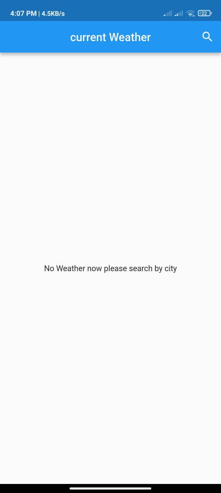
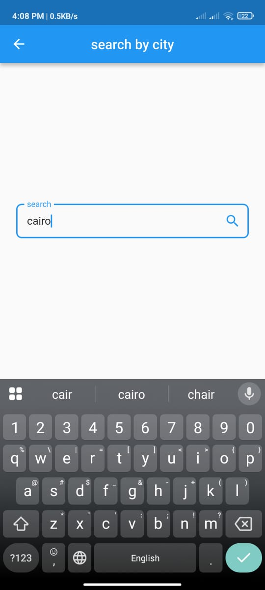
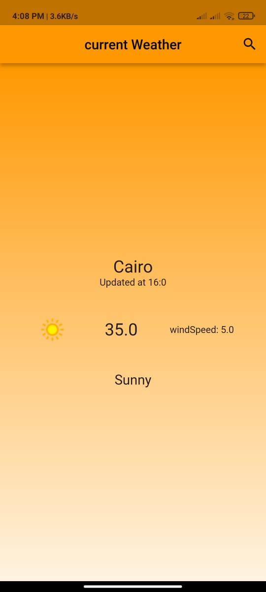
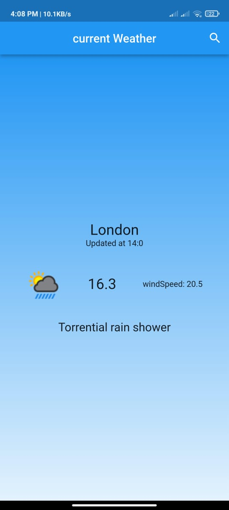

# Weather App 🌦️

## 📌 Overview
A real-time **Weather Application** built with **Flutter**.  
This app lets users search for a city and view its current weather details.  
It also features a **dynamic theme** that changes color depending on the weather condition.

## 🛠️ Technologies & Tools
- **Flutter & Dart**
- **Cubit** (State Management)
- **Weather API**
- **Clean Architecture & OOP Principles**

## 🚀 Features
- 🔍 Search for any city by name
- 🌡️ View real-time weather details: temperature, condition, wind speed, last updated time
- 🎨 Dynamic theme → background color changes with weather condition (Sunny, Cloudy, Rainy, etc.)
- ⚡ Fast API integration for real-time updates
- 🛠️ State management with Cubit for clean logic separation

## 📱 Screens
- **Home Screen** → Displays "No Weather" initially
- **Search Screen** → Search for a city and fetch data
- **Weather Result Screen** → Shows city name, condition, temperature, wind speed, and update time
- **Dynamic Theme** → UI adapts its colors based on the weather

## 🖼️ Screenshots

| No Weather                                      | Search City                              | Weather Result                                  | Another City                                   | Weather State                                    |
|-------------------------------------------------|------------------------------------------|-------------------------------------------------|------------------------------------------------|--------------------------------------------------|
|  |  |  |  |  |

## 📂 Project Structure
- `lib/cubit/` → Business logic with Cubit
- `lib/models/` → Weather model
- `lib/screens/` → Home, Search, Result
- `lib/services/` → API calls
- `lib/theme/` → Dynamic theme configuration

## 🚧 Future Improvements
- 🌍 **Multi-language support** → English/Arabic
- 📍 **Location-based weather** → detect weather automatically via GPS
- ⏱️ **Hourly/Daily forecast** → more detailed predictions
- 🌦️ **Weather alerts** → notify users about extreme conditions

## ▶️ Demo
[Download APK](https://drive.google.com/file/d/1d9YPBesNun_7oQ1ipSpEXB0p_2A9le_m/view?usp=drivesdk) 

## 👨‍💻 Author
Mohamed Abdalla Moussa Ibrahim  
[GitHub](https://github.com/mohamed-abdallah-mouse/Wather_app) | [LinkedIn](https://www.linkedin.com/in/mohamed-abdallah-mouse-69419a1b8)

